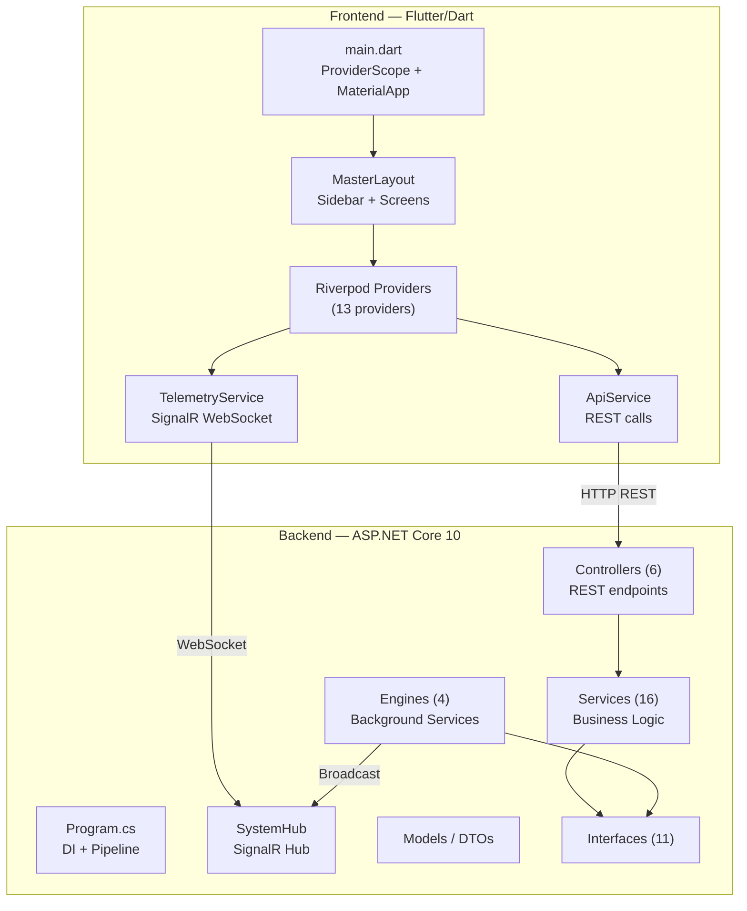

# 🦅 GS System Analyzer — Full Repository Analysis

## 1. Project Overview

**GS System Analyzer** is a cross-platform system telemetry & disk management desktop application with a "Cyber-HUD" aesthetic. It combines the functionality of Task Manager, TreeSize, and HWiNFO into a single open-source tool.

| Aspect | Detail |
|---|---|
| **Status** | Pre-Beta v2.0 (targeting June 2026 public beta) |
| **Backend** | ASP.NET Core 10 (C#), .NET 10 multi-target (`net10.0-windows;net10.0`) |
| **Frontend** | Flutter/Dart with Riverpod state management |
| **Communication** | REST API + SignalR WebSocket hub |
| **Key Deps** | LibreHardwareMonitor, PerformanceCounter, fl_chart, signalr_netcore |

---

## 2. Architecture

### Core Architectural Rule
> *"All OS-level work happens in C#, and data reaches Flutter only via SignalR streams or REST."*

This is consistently upheld — the Flutter side never performs direct OS I/O.

---

## 3. Backend Deep-Dive

### 3.1 Entry Point — [Program.cs](file:///c:/Users/USER/My%20Project/GSInteractiveDeviceAnalyzer/backend/Program.cs)

Minimal API bootstrap with DI registrations, CORS, controllers, and SignalR. Platform-conditional registration (Windows vs Linux) for CPU and thermal providers.

### 3.2 Engine Layer

| Engine | File | Role |
|---|---|---|
| **DiskScannerEngine** | [DiskScannerEngine.cs](file:///c:/Users/USER/My%20Project/GSInteractiveDeviceAnalyzer/backend/Engine/DiskScannerEngine.cs) | Parallel directory scanning with `ConcurrentDictionary` cache, `FileSystemWatcher` live radar, JSON persistence, nuke/scan cancellation tokens |
| **CpuSamplerEngine** | [CpuSamplerEngine.cs](file:///c:/Users/USER/My%20Project/GSInteractiveDeviceAnalyzer/backend/Engine/CpuSamplerEngine.cs) | `BackgroundService` polling CPU metrics on a periodic timer, broadcasting via SignalR |
| **RamMonitoringEngine** | [RamMonitoringEngine.cs](file:///c:/Users/USER/My%20Project/GSInteractiveDeviceAnalyzer/backend/Engine/RamMonitoringEngine.cs) | On-demand RAM radar loop — top-N processes by working set, global memory metrics, process kill ("ExecuteOrder66") |
| **ThermalMonitoringEngine** | [ThermalMonitoringEngine.cs](file:///c:/Users/USER/My%20Project/GSInteractiveDeviceAnalyzer/backend/Engine/ThermalMonitoringEngine.cs) | `BackgroundService` polling thermal providers, broadcasting via SignalR |

### 3.3 Controller Layer (6 controllers)

| Controller | Route Prefix | Endpoints |
|---|---|---|
| [StorageController](file:///c:/Users/USER/My%20Project/GSInteractiveDeviceAnalyzer/backend/Controllers/StorageController.cs) | `api/storage` | `POST scan`, `POST stream-sector`, `GET drive-stats`, `POST abort-scan`, `POST duplicates`, `GET scan-largefiles` |
| [NukeController](file:///c:/Users/USER/My%20Project/GSInteractiveDeviceAnalyzer/backend/Controllers/NukeController.cs) | `api/nuke` | `POST preview`, `DELETE execute`, `POST abort` |
| [TelemetryController](file:///c:/Users/USER/My%20Project/GSInteractiveDeviceAnalyzer/backend/Controllers/TelemetryController.cs) | `api/telemetry` | `POST ram/start`, `POST ram/stop`, `POST ram/kill`, `GET cpu-load` |
| [ThermalController](file:///c:/Users/USER/My%20Project/GSInteractiveDeviceAnalyzer/backend/Controllers/ThermalController.cs) | `api/thermal` | `GET current` |
| [DrivesController](file:///c:/Users/USER/My%20Project/GSInteractiveDeviceAnalyzer/backend/Controllers/DrivesController.cs) | `api/drives` | `GET` (list all drives) |
| [SettingsController](file:///c:/Users/USER/My%20Project/GSInteractiveDeviceAnalyzer/backend/Controllers/SettingsController.cs) | `api/settings` | `GET`, `GET defaults`, `POST`, `POST reset`, `PATCH partial` |

### 3.4 Service Layer Highlights

- **NukeProtocolService** — Batch deletion with `AggressiveObliterate` (strips all file attributes before recursive delete), cache invalidation up the tree, progress streaming over SignalR.
- **DuplicateFileDetector** — Two-pass algorithm: O(n) size filter → parallel SHA-256 hashing via `ConcurrentDictionary`.
- **LargeFileHunterService** — Min-heap (`PriorityQueue`) for efficient top-N tracking without sorting the full set.
- **LibreThermalProvider** — 3-tier fallback: LibreHardwareMonitor → Dell OEM VBS → WMI. Last-good-payload cache for resilience.
- **SettingsServices** — JSON-file persistence with atomic write (temp file + `File.Move`), hot-reload via `OnSettingsChanged` event.

### 3.5 Background Workers

- [DriveMonitorService](file:///c:/Users/USER/My%20Project/GSInteractiveDeviceAnalyzer/backend/BackgroundWorkers/DriveMonitorService.cs) — Polls every 5s for hardware changes (USB plug/unplug), every 60s for disk-space alerts (>90% threshold), broadcasts via SignalR.

### 3.6 Test Suite

11 test files across 3 categories:

| Category | Test Files |
|---|---|
| **Services** | `DuplicateFileDetectorTests`, `LargeFileHunterServiceTests`, `NukeProtocolServiceTests`, `DellOemTelemetryTests`, `SettingIntegrationTest` |
| **Engines** | `LibreThermalProviderTests`, `LinuxCpuProviderTest`, `LinuxThermalProviderTest`, `WindowsCpuProviderTest` |
| **Controllers** | `ScanControllerMultiDriveTests`, `SettingsContollerTest` |

---

## 4. Frontend Deep-Dive

### 4.1 App Shell

[main.dart](file:///c:/Users/USER/My%20Project/GSInteractiveDeviceAnalyzer/frontend/gs_anlyzer_ui/lib/main.dart) → `ProviderScope` → `MaterialApp` (dark theme) → [MasterLayout](file:///c:/Users/USER/My%20Project/GSInteractiveDeviceAnalyzer/frontend/gs_anlyzer_ui/lib/screen/master_layout.dart) (sidebar + screen switcher).

### 4.2 Screen Inventory (7 screens)

| Screen | Purpose | Status |
|---|---|---|
| `AnalyzerDashboard` | Storage explorer with directory tree, nuke protocol, duplicate/large file scanners | ✅ Live |
| `CpuMetricsScreen` | Real-time CPU load, per-core groups, frequency | ✅ Live |
| `RamScannerScreen` | Per-process RAM breakdown, kill processes | ✅ Live |
| `ThermalModuleScreen` | CPU/GPU/Board/NVMe temps, fan RPMs, throttle detection | 🛠️ In Progress |
| `SettingsScreen` | Full settings panel with validation | ✅ Live |
| Network module | Placeholder | ⏳ Planned |
| Main dashboard | Placeholder | ⏳ Planned |

### 4.3 State Management — 13 Riverpod Providers

Providers cover: navigation, directory tree, drive stats, CPU/RAM/thermal telemetry, duplicate/large file scanning, nuke protocol, settings, and storage mode.

### 4.4 Design System — [HudTheme](file:///c:/Users/USER/My%20Project/GSInteractiveDeviceAnalyzer/frontend/gs_anlyzer_ui/lib/utils/hud_theme.dart)

Custom "Cyber-HUD" design system with:
- Dark base colors (`#161616`, `#1E1E1E`)
- Cyan/green/red/amber accent palette
- Monospace `Courier` typography
- Glowing bordered panel decorations

### 4.5 Communication Layer

| Service | Transport | Purpose |
|---|---|---|
| [ApiService](file:///c:/Users/USER/My%20Project/GSInteractiveDeviceAnalyzer/frontend/gs_anlyzer_ui/lib/services/api_service.dart) | HTTP REST | Request-response operations (scan, nuke, settings) |
| [TelemetryService](file:///c:/Users/USER/My%20Project/GSInteractiveDeviceAnalyzer/frontend/gs_anlyzer_ui/lib/services/telemetry_service.dart) | SignalR WebSocket | Real-time streaming (CPU, RAM, thermal, scan progress, radar alerts) |

---

## 5. CI/CD Pipeline

Two GitHub Actions workflows:

| Workflow | File | Runs On | Steps |
|---|---|---|---|
| `.NET Build & Test` | [dotnet-desktop.yml](file:///c:/Users/USER/My%20Project/GSInteractiveDeviceAnalyzer/.github/workflows/dotnet-desktop.yml) | `windows-latest` | Checkout → Setup .NET → Restore → Build → Test → Discord Notify |
| `Dart Lint & Test` | [dart.yml](file:///c:/Users/USER/My%20Project/GSInteractiveDeviceAnalyzer/.github/workflows/dart.yml) | — | Flutter analysis & testing |

---

## 6. Bugs & Issues Found

### 🔴 Critical

| # | Location | Issue |
|---|---|---|
| 1 | [Program.cs:13+26](file:///c:/Users/USER/My%20Project/GSInteractiveDeviceAnalyzer/backend/Program.cs#L13-L26) | **Duplicate DI registration** — `DiskScannerEngine` is registered as singleton **twice** (lines 13 and 26). Same for `LargeFileHunterService` (lines 29-30 and 59) and `NukeProtocolService` (lines 31 and 60). This wastes memory and could cause confusing DI resolution issues. |
| 2 | [DuplicateFileDetector.cs:132](file:///c:/Users/USER/My%20Project/GSInteractiveDeviceAnalyzer/backend/Services/DuplicateFileDetector.cs#L132) | **String literal instead of variable** — `file.FullName.Contains("appDataSegment", ...)` uses the literal string `"appDataSegment"` instead of the variable `appDataSegment`. This means AppData paths are **never** filtered out. |
| 3 | [TelemetryService.dart:103](file:///c:/Users/USER/My%20Project/GSInteractiveDeviceAnalyzer/frontend/gs_anlyzer_ui/lib/services/telemetry_service.dart#L103) | **Logic inversion bug** — `if (arguments == null && arguments!.isEmpty)` should be `\|\|` not `&&`. With `&&`, if `arguments` is null, the `arguments!.isEmpty` is never reached (short-circuit), but if `arguments` is non-null, the null-check passes, and it tries `isEmpty`. This effectively never returns early on empty lists — and if arguments *is* null, it falls through and crashes on line 105. |
| 4 | [dotnet-desktop.yml:29](file:///c:/Users/USER/My%20Project/GSInteractiveDeviceAnalyzer/.github/workflows/dotnet-desktop.yml#L29) | **CI SDK mismatch** — CI uses `dotnet-version: '8.0.x'` but the project targets `net10.0`. The CI build will fail or not test against the actual target framework. |

### 🟡 Medium

| # | Location | Issue |
|---|---|---|
| 5 | [DiskScannerEngine.cs:157-161](file:///c:/Users/USER/My%20Project/GSInteractiveDeviceAnalyzer/backend/Engine/DiskScannerEngine.cs#L157-L161) | **Unused `EnumerationOptions`** — `option` is created but never passed to `dir.GetFiles()` on line 162. The options (including `IgnoreInaccessible`) are silently ignored. |
| 6 | [StorageController.cs:49+58](file:///c:/Users/USER/My%20Project/GSInteractiveDeviceAnalyzer/backend/Controllers/StorageController.cs#L49-L58) | **Duplicate `DirectoryStreamComplete`** — Sent both in the `try` block (line 49) and the `finally` block (line 58), meaning the client always receives it twice on success. |
| 7 | [DiskScannerEngine.cs:24](file:///c:/Users/USER/My%20Project/GSInteractiveDeviceAnalyzer/backend/Engine/DiskScannerEngine.cs#L24) | **Cache path is relative** — `_cacheFilePath = "scanner_memory.json"` resolves relative to the working directory, which varies depending on how the app is launched. This 63 MB file could end up in unexpected locations. Should use an absolute path (e.g., AppData). |
| 8 | [ApiService.dart:77](file:///c:/Users/USER/My%20Project/GSInteractiveDeviceAnalyzer/frontend/gs_anlyzer_ui/lib/services/api_service.dart#L77) | **Wrong abort URL** — `abortNuke()` calls `$nukeUrl/nuke` instead of `$nukeUrl/abort`. The nuke abort signal will never reach the backend. |
| 9 | [ApiService.dart:253](file:///c:/Users/USER/My%20Project/GSInteractiveDeviceAnalyzer/frontend/gs_anlyzer_ui/lib/services/api_service.dart#L253) | **Wrong HTTP method for reset** — Uses `http.delete` but the backend expects `POST` at `api/settings/reset`. Will return 405 Method Not Allowed. |
| 10 | [WindowsCpuProvider.cs:81-83](file:///c:/Users/USER/My%20Project/GSInteractiveDeviceAnalyzer/backend/Services/WindowsCpuProvider.cs#L81-L83) | **Hardcoded cache sizes** — L1/L2/L3 cache sizes are hardcoded strings instead of being read from the system. Will be wrong on most machines. |
| 11 | [Program.cs:17-22](file:///c:/Users/USER/My%20Project/GSInteractiveDeviceAnalyzer/backend/Program.cs#L17-L22) | **Overly permissive CORS** — `AllowAnyOrigin().AllowAnyHeader().AllowAnyMethod()` in production is a security risk. Should be restricted to `http://localhost:*` or the Flutter app's origin. |
| 12 | [StorageController.cs:20-21](file:///c:/Users/USER/My%20Project/GSInteractiveDeviceAnalyzer/backend/Controllers/StorageController.cs#L20-L21) | **Scan endpoint mismatch** — `POST scan` expects `[FromBody] ScanRequest` but the Flutter `scanDirectory()` sends a `GET` with query parameters. These will never communicate correctly. |
| 13 | [DriveMonitorService.cs:29](file:///c:/Users/USER/My%20Project/GSInteractiveDeviceAnalyzer/backend/BackgroundWorkers/DriveMonitorService.cs#L29) | **Missing space in generic** — `ILogger<DriveMonitorService>logger` is missing a space. This compiles in C# but is a style issue that suggests it might have been a copy-paste artifact. |

### 🟢 Low / Code Quality

| # | Location | Issue |
|---|---|---|
| 14 | [DiskScannerEngine.cs:25](file:///c:/Users/USER/My%20Project/GSInteractiveDeviceAnalyzer/backend/Engine/DiskScannerEngine.cs#L25) | Typo: `_liveRader` should be `_liveRadar` (used throughout the file) |
| 15 | [SettingsServices.cs:11](file:///c:/Users/USER/My%20Project/GSInteractiveDeviceAnalyzer/backend/Services/SettingsServices.cs#L11) | Typo: `_fileLoack` should be `_fileLock` |
| 16 | [InteractiveAnalyzer.cs](file:///c:/Users/USER/My%20Project/GSInteractiveDeviceAnalyzer/backend/InteractiveAnalyzer.cs) | Entire class is commented out — dead code from the original console UI. Should be removed. |
| 17 | Multiple files | `FormatSize()` utility is duplicated in `NukeProtocolService`, `LargeFileHunterService`, and `DriveMonitorService`. Should be extracted to a shared utility. |
| 18 | [DiskScannerEngine.cs:190-192](file:///c:/Users/USER/My%20Project/GSInteractiveDeviceAnalyzer/backend/Engine/DiskScannerEngine.cs#L190-L192) | **Silent exception swallowing** — `catch (Exception e) { }` silently eats all errors in `GetDirectorySize`. At minimum, log the error. |
| 19 | [ThermalMonitoringEngine.cs:34-43](file:///c:/Users/USER/My%20Project/GSInteractiveDeviceAnalyzer/backend/Engine/ThermalMonitoringEngine.cs#L34-L43) | **Platform check at runtime** — The `if (Windows)` branch is checked on every tick despite being a compile-time constant. The non-Windows path returns an empty DTO instead of using the registered `LinuxThermalProvider`. |
| 20 | Frontend | Extensive `print()` debug logging throughout production code (e.g., "MATRIX BRIDGE FIRING", "FEDEX BOX OPENED"). Should use a proper logging framework or be gated behind a debug flag. |
| 21 | [DiskOperationsService.cs:42](file:///c:/Users/USER/My%20Project/GSInteractiveDeviceAnalyzer/backend/Services/DiskOperationsService.cs#L42) | **Sync-over-async** — `.GetAwaiter().GetResult()` blocks the calling thread. This can cause deadlocks in ASP.NET Core's thread pool under load. Should be properly `await`ed. |

---

## 7. Architecture Assessment

### ✅ Strengths

1. **Clean frontend/backend separation** — The architectural rule is respected. Zero OS calls from Flutter.
2. **Interface-driven design** — 11 interfaces decouple implementations. Great for testability (evidenced by the test suite using fakes).
3. **Platform abstraction** — Windows/Linux CPU and thermal providers behind `ICpuMetricsProvider` / `IThermalProvider` with compile-time `#if` guards.
4. **Real-time architecture** — SignalR used effectively for 7+ different event types (scan progress, radar, nuke progress, CPU/RAM/thermal telemetry, drive alerts).
5. **Robust deletion** — The Nuke Protocol has proper safeguards: dry run preview, `C:\Windows` protection, cancellation tokens, progress streaming.
6. **Smart algorithms** — Min-heap for large file hunting, two-pass duplicate detection (size filter → hash), stale cache detection via `LastWriteTimeUtc`.
7. **Comprehensive test coverage** — Tests span all three layers (controllers, engines, services) with proper fakes/mocks.
8. **Thermal resilience** — 3-tier fallback (LibreHW → Dell OEM → WMI) plus last-good-payload caching.

### ⚠️ Areas for Improvement

1. **DI registration hygiene** — Multiple duplicate registrations create noise and confusion.
2. **Structured logging** — Replace `Console.WriteLine` with `ILogger<T>`. The thematic log messages ("RADAR ONLINE", "ASSASSINATED PID") are fun but should use proper log levels.
3. **Error handling consistency** — Mix of silent swallowing (`catch { }`), console logging, and proper exception propagation.
4. **API contract mismatches** — Several frontend/backend communication bugs (wrong HTTP methods, wrong URLs, GET vs POST).
5. **Configuration management** — The 63 MB `scanner_memory.json` is in the repo root and uses a relative path.
6. **Security** — Open CORS policy, no authentication/authorization, no rate limiting on destructive endpoints.

---

## 8. File & Directory Statistics

| Section | Files | Lines (est.) |
|---|---|---|
| Backend — Controllers | 6 | ~660 |
| Backend — Engines | 4 | ~610 |
| Backend — Services | 16 | ~2,100 |
| Backend — Models/DTOs | 23 | ~350 |
| Backend — Interfaces | 11 | ~120 |
| Backend — Tests | 11 | ~1,400 |
| Frontend — Screens | 7 | ~1,200 |
| Frontend — Providers | 13 | ~800 |
| Frontend — Widgets | 12 | ~1,100 |
| Frontend — Services | 2 | ~420 |
| Frontend — Models | 9 | ~350 |
| Frontend — Utils | 4 | ~150 |
| **Total** | **~118** | **~9,260** |

---

## 9. Prioritised Recommendations

### Immediate (Pre-Beta Blockers)

1. **Fix the `DuplicateFileDetector` string bug** (#2) — AppData exclusion is completely broken
2. **Fix the `abortNuke()` URL** (#8) — Users cannot abort nuke operations
3. **Fix the settings reset HTTP method** (#9) — Reset button is non-functional
4. **Fix the RAM telemetry null check** (#3) — Will crash on null payloads
5. **Update CI to .NET 10** (#4) — Builds are failing or testing wrong framework
6. **Remove duplicate DI registrations** (#1) — Clean up before anyone else contributes
7. **Fix the scan endpoint GET/POST mismatch** (#12) — Front-to-back communication is broken

### Short-Term (Before v2.0)

8. Replace `Console.WriteLine` with `ILogger<T>` across the backend
9. Extract `FormatSize()` to a shared utility class
10. Move `scanner_memory.json` to AppData with an absolute path
11. Add `.gitignore` entry for `scanner_memory.json` (63 MB binary in repo root)
12. Fix the `EnumerationOptions` not being passed to `GetFiles()` in `DiskScannerEngine`
13. Remove the commented-out `InteractiveAnalyzer` class
14. Strip `print()` debug spam from Flutter production code

### Medium-Term (v2.1+)

15. Add authentication/authorization to destructive endpoints
16. Restrict CORS to known origins
17. Add rate limiting to nuke/scan endpoints
18. Implement structured logging with Serilog or similar
19. Read actual CPU cache sizes from the system instead of hardcoding
20. Fix `sync-over-async` in `DiskOperationsService.ScanDirectory`
